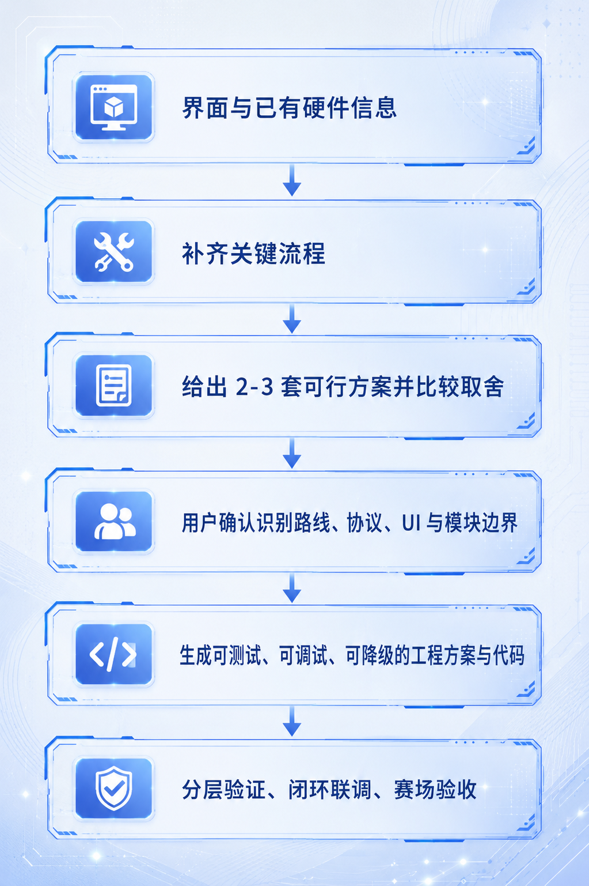

# MaixCAM 电赛视觉 Skill


为 MaixCAM+ MaixPy 电子设计竞赛视觉项目准备的 Codex Skill。

它不是一份固定题目的代码，也不是某一种串口协议模板。它的目标是让 Codex 在拿到题面和硬件约束后，像一位懂 MaixCAM 的视觉工程搭档一样，先把问题问清楚、给出可选方案，再协助完成工程设计、代码、调试和验收。

## 能做什么

- 拆解电赛视觉题：目标、评分点、时限、精度、场地和安全约束。
- 为激光打靶、巡线、黑框/靶纸、棋盘与格点、单目测量、协同控制等任务选择传统视觉路线。
- 为动物、目标类别或复杂外观识别任务规划 YOLO 数据采集、标注、训练、`.mud` 部署与误检处理。
- 设计 MaixCAM 与下位机之间的通信、屏幕 UI、模块边界、独立测试和闭环联调流程。
- 依据 MaixPy 官方 API 检查代码，避免混入 OpenMV、K210、树莓派或 PC OpenCV 专属写法。

## 它如何工作



首次使用时，若题面或附件没有提供足够信息，Skill 会优先确认题型与评分、识别对象和输出、MaixCAM/相机、屏幕尺寸与方向、引脚与逻辑电平、下位机与执行机构、供电/急停和场地限制。

协议格式、坐标单位、发送频率、ACK/心跳、模型、引脚映射和 UI 都不会被擅自固定；它们必须由题目约束和你的选择决定。

## 快速开始

在 Codex 中说明：

```text
请使用 $skill-installer 从 GitHub 仓库 LanHua01/-MaixCAM-skill 安装根目录的 maixcam-pro-nuedc Skill。
```

安装后新开一个对话，或显式输入 `$maixcam-pro-nuedc`。随后提供题面、接线图、已有协议、模型或样例图片中的任意部分即可开始。

> 仓库将 Skill 放在根目录；使用安装器脚本时需指定 `--path . --name maixcam-pro-nuedc`。

## 项目特点


## 仓库内容

- [SKILL.md](SKILL.md)：核心工作流、首次配置门禁和 MaixPy 语法约束。
- [references/](references/)：MaixPy API、视觉题型、工程架构、排错手册、公开题名覆盖和验证场景。
- [templates/](templates/)：问询表、方案矩阵、工程架构、串口决策、YOLO 数据训练与验收模板。

## 使用边界

- 仅以 MaixPy 官方文档作为 API 与硬件事实依据。
- 不内置或下载未经授权的数据集、模型、密钥或个人信息。
- 历年题目资料只整理公开题名、年份和适用性，不收录本地路径或题面全文。

## 参考

- [MaixPy 官方文档](https://wiki.sipeed.com/maixpy/doc/zh/index.html)
- [Codex Skills 文档](https://learn.chatgpt.com/docs/build-skills)
