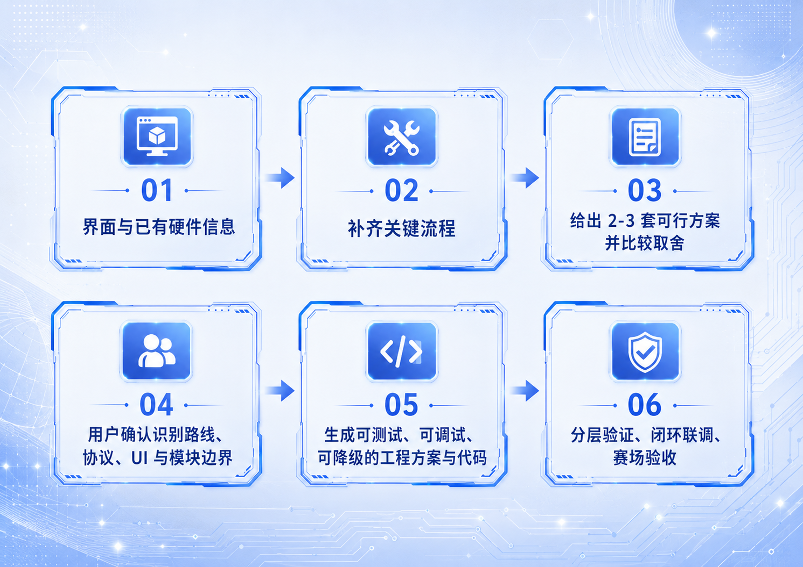
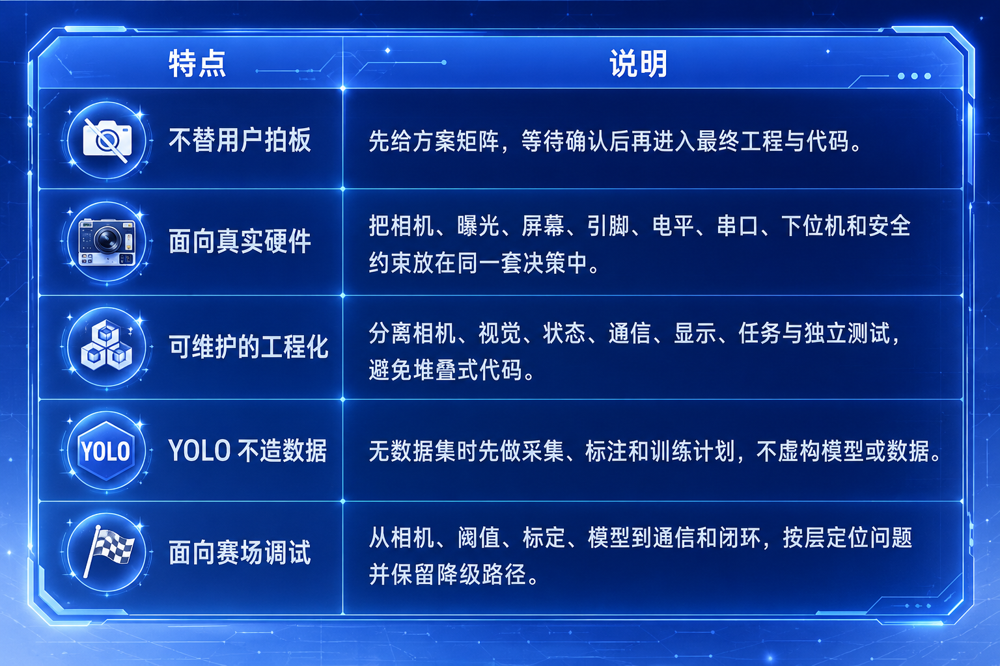

# MaixCAM 电赛视觉 Skill


为 MaixCAM / MaixCAM Pro + MaixPy 电子设计竞赛视觉项目准备的 Codex Skill。

它不是一份固定题目的代码，也不是某一种串口协议模板。它的目标是让 Codex 在拿到题面和硬件约束后，像一位懂 MaixCAM 的电赛协作搭档一样，按评分优先完成最小闭环，再协助实现、联调、现场止损和验收。

## 能做什么

- 拆解电赛视觉题：目标、评分点、时限、精度、场地和安全约束。
- 为激光打靶、巡线、黑框/靶纸、棋盘与格点、单目测量、协同控制等任务选择传统视觉路线。
- 为动物、目标类别或复杂外观识别任务规划 YOLO 数据采集、标注、训练、`.mud` 部署与误检处理。
- 设计 MaixCAM 与下位机之间的通信、心跳/ACK/超时策略、屏幕 UI、模块边界、独立测试和闭环联调流程。
- 依据 MaixPy 官方 API 检查代码，避免混入 OpenMV、K210、树莓派或 PC OpenCV 专属写法。
- 接管已有工程故障，核对源码、入口、资源、部署包与板端实际运行身份。

## 它如何工作



首次使用时，若题面或附件没有提供足够信息，Skill 会先确认题型与评分、识别对象和输出、MaixCAM/相机、场地限制、比赛剩余时间，以及是否实际存在通信、执行机构、独立 UI、现场调参和模型需求；只有存在的模块才继续追问屏幕、引脚、协议、急停或数据集细节。

协议格式、坐标单位、发送频率、ACK/心跳、模型、引脚映射和 UI 都不会被擅自固定；它们必须由题目约束和你的选择决定。

确认方案后，Skill 会按风险交付工程：简单任务优先只有一个 `main.py`，确有复用、通信、UI、模型、安全或独立风险时才增加必要模块。用户在 MaixVision 打开工程文件夹并运行完整项目，即可部署到设备开始调试；多文件或带模型的工程不会要求只运行当前文件。

## 快速开始

在 Codex 中说明：

```text
请使用 $skill-installer 从 GitHub 仓库 LanHua01/MaixCAM-skill 安装 maixcam-pro-nuedc Skill。
```

安装后新开一个对话，或显式输入 `$maixcam-pro-nuedc`。随后提供题面、接线图、已有协议、模型或样例图片中的任意部分即可开始。

## 项目特点



- **评分优先、先基础后发挥**：把题面条款映射到得分与验收，先完成基础得分最小闭环，再实现有回退点的提高/发挥功能；默认建议把最后 25% 时间留给场地和稳定性。
- **先确认，再实现**：题目不足以确定硬件、协议或 UI 时先收集配置；只有存在真实取舍时才给 2–3 套方案，否则直接给最简合格路线和排除理由。
- **快速问题不走重流程**：最小相机、UART 收发或 API 核对只收集必要信息，输出独立验证与排查；涉及工程、闭环或协议设计时才进入完整门禁。
- **传统视觉与 YOLO 按题选型**：优先使用可验证的颜色、几何和标定路线；确需模型时再进入数据集与训练计划。
- **可信题库路由**：先匹配视觉原型，再参考七个已完整核验的历史视觉题，最后回到当前题面；176 条题名档案只提供检索键，不会按题名猜方案。
- **条件在线检索**：陌生题或需核验规则/API/版本时，再查官方资料与公开案例；输出链接、事实、经验和待确认项，用户可明确禁止联网。
- **先合格、再最简**：先满足评分、安全、时限和性能预算，再选择依赖更少、标定更轻、模块更少且性能余量更大的路线。
- **模型先看板端版本**：YOLOv5/v8/11/26 先按目标板 MaixPy 版本筛选，再比较精度、时延和部署资源。
- **按需工程交付**：最小验证、紧凑工程和完整闭环工程按风险选择；紧凑工程默认只有 `main.py`，仅在确有调参、复杂度或独立风险时增加文件，避免空模块堆砌。
- **可测、可调、可降级**：相机、视觉、模型、串口、执行安全和性能分别验证，再进行低速闭环。
- **性能不靠猜测**：要求在目标 MaixCAM/MaixCAM Pro 上记录 FPS、时延、连续运行与异常；不达标时输出问题、优化选项和回归测试。
- **面向真实调试**：覆盖 MaixVision 连接、完整项目运行、预览、资源上传、日志、打包与安装问题。
- **故障接管与现场止损**：已有工程按“实际版本→调用链→复现→根因→单根因修复→板端复测”推进；同一问题两次失败后停止补丁，转查源码到板端全链路。
- **能力按版本选择**：覆盖 Blob/LAB、Line/Edge、Geometry、QR/AprilTag、Detection、OBB、Segmentation 和 Tracking；高级模型只在评分确有需要时进入候选。
- **已有工程诊断工具**：可静态检查入口、资源、API 边界和热循环成本，并生成运行指纹；工具不会自动访问设备，也不会被部署到 MaixCAM。

## 仓库内容

- [SKILL.md](SKILL.md)：核心工作流、首次配置门禁和 MaixPy 语法约束。
- [references/](references/)：MaixPy API、版本化视觉能力、视觉原型、已核验历史题、题名档案、工程架构、MaixVision/性能排错和验证场景。
- [templates/](templates/)：问询表、评分路线、方案矩阵、工程架构、串口可靠性、YOLO 数据训练、性能报告与验收模板。
- [scripts/](scripts/)：四个只使用 Python 标准库的已有工程诊断工具。

## 脚本用途

这些脚本由 Codex 或 Skill 维护者在电脑端按需运行，不属于生成给 MaixCAM 的比赛工程，也不会自动连接、读取或修改设备。

| 文件 | 用途 | 面向对象 |
| --- | --- | --- |
| `inspect_maix_project.py` | 提取工程入口、导入关系、相机、显示、UART、模型、视觉调用和资源路径 | 使用者 / Codex |
| `check_runtime_fingerprint.py` | 生成源码、配置、模型和资源指纹，辅助核对工作区、部署包与板端证据 | 使用者 / Codex |
| `check_maixpy_api_usage.py` | 标出明显混入的 OpenMV、K210 或桌面专属调用，并提示待官方核验项 | 使用者 / Codex |
| `estimate_frame_cost.py` | 统计主循环中的视觉、推理、绘制、通信和重复分配调用，只报告结构性风险 | 使用者 / Codex |

这些工具只提供静态证据和风险提示，不能代替 MaixPy 官方文档核验、板端日志或目标板实测。

## 使用边界

- 仅以 MaixPy 官方文档作为 API 与硬件事实依据。
- 官方资料与原始题面确定事实；公开项目和教程仅补充工程经验，不直接复制社区代码或覆盖题面约束。
- 不内置或下载未经授权的数据集、模型、密钥或个人信息。
- 题名档案不记录未经题面确认的视觉适用性；已核验题只保留任务、评分、限制、视觉职责和公开来源摘要，不收录本机路径或题面全文。
- 性能结论必须来自目标板实测；没有实测数据时明确标注为“待实测”。

## 参考

- [MaixPy 官方文档](https://wiki.sipeed.com/maixpy/doc/zh/index.html)
- [Codex Skills 文档](https://learn.chatgpt.com/docs/build-skills)
